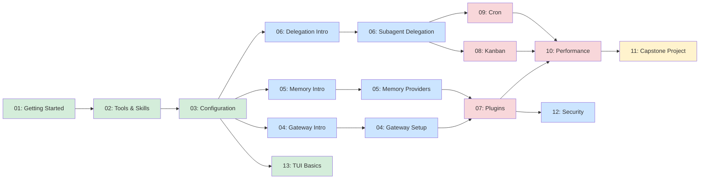

# Hermes Agent Labs

Hands-on lab guides for learning Hermes Agent from zero to proficiency. Designed for **low-attention audiences** — every lab shows results in the first 2 minutes.

## Quick Start by User Type

| If you are... | Start here | Then go to | Estimated time |
|---|---|---|---|
| **New to Hermes Agent** | [Lab 01: Getting Started](01-getting-started/beginner/getting-started.md) | Labs 02 → 03 → 13 | ~70 min |
| **Power User** (daily CLI usage) | [Lab 02: Tools & Skills](02-tools-and-skills/beginner/tools-basics.md) | Labs 05 → 06 → 10 | ~100 min |
| **Platform Admin** (messaging integrations) | [Lab 04: Gateway Intro](04-gateway/beginner/gateway-intro.md) | Labs 04 Intermediate → 09 | ~100 min |
| **Plugin Developer** (extending Hermes) | [Lab 07: Plugin Development](07-plugins/advanced/plugin-development.md) | Lab 02 Intermediate | ~60 min |
| **Multi-Agent Architect** (Kanban/Cron) | [Lab 08: Kanban Workflows](08-kanban/advanced/kanban-workflows.md) | Labs 06 → 09 → 10 | ~125 min |
| **Security Engineer** | [Lab 12: Security Basics](12-security/intermediate/security-basics.md) | Labs 07 → 10 | ~95 min |
| **All Labs** (complete mastery) | Lab 01 → Lab 13 sequentially | — | ~345 min |

## Folder Structure

```
knowledge/labs/
├── 01-getting-started/
│   └── beginner/
│       └── getting-started.md
├── 02-tools-and-skills/
│   ├── beginner/
│   │   └── tools-basics.md
│   └── intermediate/
│       └── skills-system.md
├── 03-configuration/
│   ├── beginner/
│   │   └── config-basics.md
│   └── intermediate/
│       └── profiles.md
├── 04-gateway/
│   ├── beginner/
│   │   └── gateway-intro.md
│   └── intermediate/
│       └── gateway-setup.md
├── 05-memory/
│   ├── beginner/
│   │   └── memory-intro.md
│   └── intermediate/
│       └── memory-providers.md
├── 06-delegation/
│   ├── beginner/
│   │   └── delegation-intro.md
│   └── intermediate/
│       └── subagent-delegation.md
├── 07-plugins/
│   └── advanced/
│       └── plugin-development.md
├── 08-kanban/
│   └── advanced/
│       └── kanban-workflows.md
├── 09-cron/
│   └── advanced/
│       └── cron-jobs.md
├── 10-performance/
│   └── advanced/
│       └── performance-tuning.md
├── 11-capstone/
│   └── advanced/
│       └── monitoring-system.md
├── 12-security/
│   └── intermediate/
│       └── security-basics.md
└── 13-tui/
    └── beginner/
        └── tui-basics.md
```

## Learning Path



**Legend:** 🟢 Beginner | 🔵 Intermediate | 🔴 Advanced | 🟡 Capstone

## Topics Covered

| # | Topic | Level | Time | Problem Solved |
|---|-------|-------|------|----------------|
| 01 | Getting Started | Beginner | 15 min | Install Hermes and have your first conversation |
| 02 | Tools & Skills | Beginner | 20 min | Use built-in tools and the skills system |
| 03 | Configuration | Beginner | 15 min | Configure Hermes for your workflow |
| 04 | Gateway Introduction | Beginner | 20 min | Understand gateway architecture and basic setup |
| 04 | Gateway Setup | Intermediate | 25 min | Connect Hermes to messaging platforms |
| 05 | Memory Introduction | Beginner | 20 min | Understand memory system and basic configuration |
| 05 | Memory Providers | Intermediate | 25 min | Enable cross-session memory |
| 06 | Delegation Introduction | Beginner | 20 min | Understand subagent architecture and basic usage |
| 06 | Subagent Delegation | Intermediate | 25 min | Spawn parallel subagents for complex work |
| 07 | Plugin Development | Advanced | 35 min | Create custom plugins |
| 08 | Kanban Workflows | Advanced | 35 min | Multi-agent work queues |
| 09 | Cron Jobs | Advanced | 30 min | Schedule automated agent tasks |
| 10 | Performance Tuning | Advanced | 35 min | Optimize agent speed and cost |
| 11 | Capstone: Monitoring System | Capstone | 45 min | Build a complete system using gateway + cron + kanban + plugins |
| 12 | Security Basics | Intermediate | 25 min | Understand Hermes security model and hardening |
| 13 | TUI Basics | Beginner | 20 min | Use the modern Terminal UI (Ink/React) |

## Lab Completion Checklist

Track your progress:

### Beginner (Foundation)
- [ ] Lab 01: Getting Started
- [ ] Lab 02: Tools & Skills
- [ ] Lab 03: Configuration
- [ ] Lab 04: Gateway Introduction
- [ ] Lab 05: Memory Introduction
- [ ] Lab 06: Delegation Introduction
- [ ] Lab 13: TUI Basics

### Intermediate (Core Workflows)
- [ ] Lab 02 Intermediate: Skills System
- [ ] Lab 03 Intermediate: Profiles
- [ ] Lab 04: Gateway Setup
- [ ] Lab 05: Memory Providers
- [ ] Lab 06: Subagent Delegation
- [ ] Lab 12: Security Basics

### Advanced (Production Patterns)
- [ ] Lab 07: Plugin Development
- [ ] Lab 08: Kanban Workflows
- [ ] Lab 09: Cron Jobs
- [ ] Lab 10: Performance Tuning

### Capstone
- [ ] Lab 11: Monitoring System Project

## Related Resources

- [Knowledge Base](../INDEX.md) — Full documentation
- [AGENTS.md](../../AGENTS.md) — Development guide
- [Evolution Analysis](../evolve/DECISION_TRACE_INDEX.md) — Historical decisions
- [Expert Consultant](../../.roo/skills/hermes-agent-expert-consultant/SKILL.md) — Expert skill
